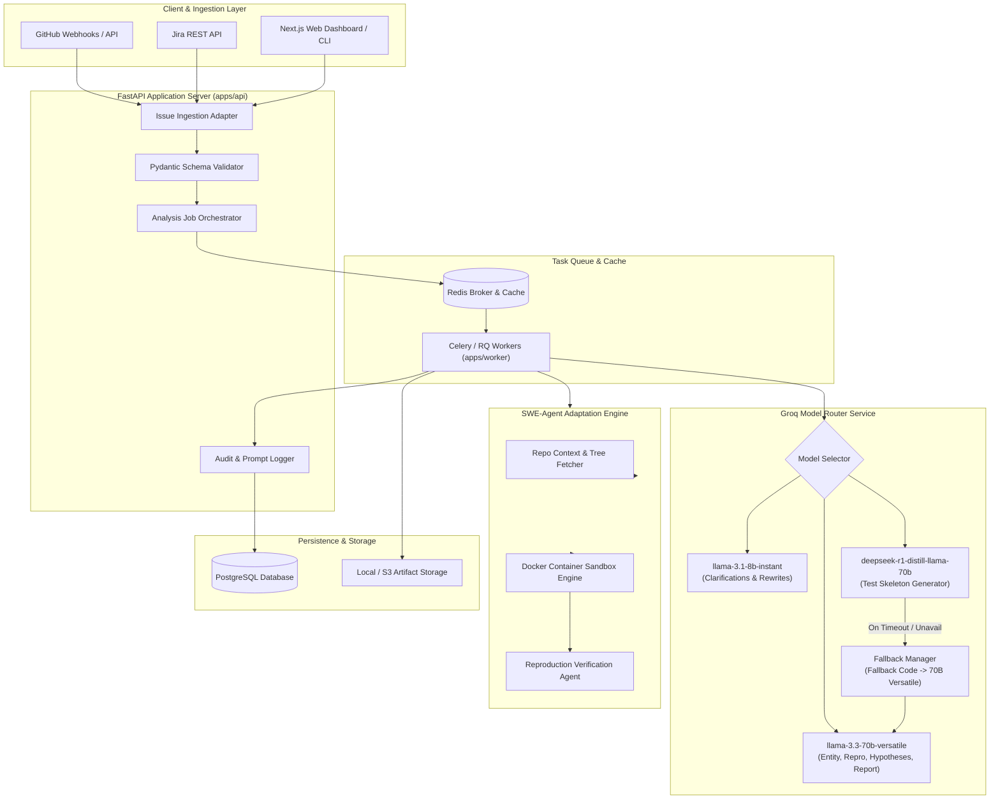
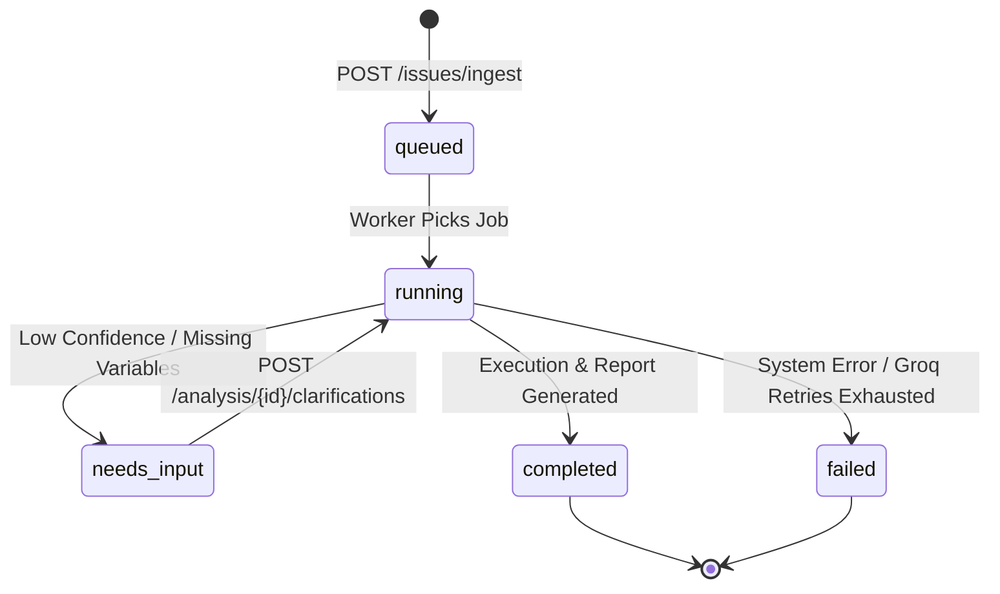
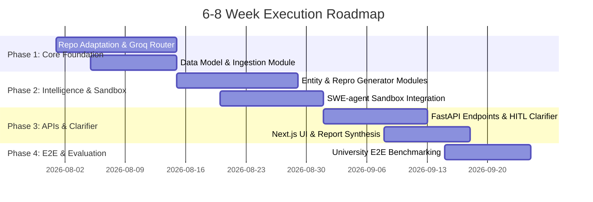

# Bug Reproducer Assistant: Architecture Blueprint & Implementation Specification

> **Adaptation Target**: Based on [SWE-agent](https://github.com/SWE-agent/SWE-agent)  
> **LLM Execution Layer**: Exclusively powered by **Groq API** (`llama-3.3-70b-versatile`, `llama-3.1-8b-instant`, `deepseek-r1-distill-llama-70b`)

---

## 1. Executive Summary

**Bug Reproducer Assistant** is a university/startup-grade AI platform designed to transform unstructured bug reports (from GitHub Issues, Jira tickets, or manual developer submissions) into deterministic, actionable, and machine-verifiable reproduction artifacts. 

Traditional issue tracking suffers from incomplete context, missing environment details, vague reproduction steps, and high context-switching overhead for developers and QA engineers. **Bug Reproducer Assistant** bridges this gap by adapting the execution harness of **SWE-agent** into an automated issue understanding, reproduction planning, test generation, and clarification pipeline.

### Key Value Propositions
- **Fact vs. Assumption vs. Unknown Strict Tripartition**: Zero hallucination on missing log traces, stack dumps, or file paths.
- **Dynamic Multi-Model Groq Routing**: Ultra-fast latency on clarification loops (`llama-3.1-8b-instant`), deep reasoning on extraction/repro/reports (`llama-3.3-70b-versatile`), and code/test generation (`deepseek-r1-distill-llama-70b`).
- **SWE-Agent Sandbox Execution Engine**: Leverages SWE-agent's containerized execution environment (`sweagent/environment`) to run generated reproduction steps in isolated Docker containers.
- **Auditability & Traceability**: Every prompt, raw LLM completion, timestamp, confidence score, and test artifact is versioned and persisted in PostgreSQL for evaluation and audit logging.

---

## 2. System Architecture

### High-Level Architecture Diagram (Mermaid)



### Module Responsibilities & End-to-End Data Flow

1. **Ingestion & Normalization**: The raw issue body, titles, tags, and metadata are received, parsed, and converted into a unified `NormalizedIssue` schema.
2. **Context Enrichment & Entity Extraction**: The worker calls `llama-3.3-70b-versatile` via the Groq Router to extract structured entities (error messages, stack traces, expected vs actual behavior, runtime versions).
3. **Ambiguity & Missing Info Check**: If confidence on mandatory environment or step variables falls below threshold ($< 0.70$), `llama-3.1-8b-instant` rapidly formulates a minimal, prioritized clarification checklist for human-in-the-loop (HITL) input.
4. **Reproduction Step & Matrix Planning**: Once sufficient information exists, `llama-3.3-70b-versatile` generates step-by-step reproduction plans along with a risk-ranked environment matrix (OS/Node/Python/Browser).
5. **Sandbox Test Skeleton Generation**: The system invokes `deepseek-r1-distill-llama-70b` (or fallback) to synthesize runnable unit, integration, or E2E test files (`pytest`, `jest`, `playwright`).
6. **SWE-agent Execution Verification**: The generated test and repro script are executed inside SWE-agent's isolated Docker container to verify whether the bug triggers state failure as expected.
7. **Report & Handoff Synthesis**: `llama-3.3-70b-versatile` combines all verified facts, inferred hypotheses, sandbox execution outputs, and test artifacts into a standardized developer handoff report (JSON + Markdown).

### Async Job Lifecycle Flow



---

## 3. Module Breakdown (MVP - 9 Core Modules)

| # | Module Name | Core Responsibility | Key Interfaces | Primary Tech Choice |
|---|---|---|---|---|
| 1 | **Issue Ingestion Module** | Receives webhook/payloads from GitHub, Jira, or manual input; normalizes into standardized format. | `IngestAdapter.normalize(raw_payload: dict) -> NormalizedIssue` | FastAPI, Pydantic, HTTPX |
| 2 | **Issue Understanding Module** | Extracts components, stack traces, versions, expected/actual behaviors; computes entity confidence. | `EntityExtractor.extract(issue: NormalizedIssue) -> ExtractedEntities` | Groq (`llama-3.3-70b-versatile`) |
| 3 | **Reproduction Planner Module** | Formulates step-by-step deterministic reproduction commands, seed data, and preconditions. | `ReproPlanner.plan(entities: ExtractedEntities) -> ReproPlan` | Groq (`llama-3.3-70b-versatile`) |
| 4 | **Environment Matrix Generator** | Constructs prioritized combination matrix of OS, runtime, dependency, and browser versions. | `EnvMatrixGen.generate(entities: ExtractedEntities) -> EnvironmentMatrix` | Python, Groq (`llama-3.3-70b-versatile`) |
| 5 | **Test Skeleton Generator** | Synthesizes language/framework aware test code (`pytest`, `jest`, `playwright`) for the bug. | `TestGen.generate(entities, plan) -> List[TestArtifact]` | Groq (`deepseek-r1-distill-llama-70b` / Fallback) |
| 6 | **Hypothesis Engine** | Bucketized root cause candidates mapped to explicit log/code evidence. | `HypothesisEngine.analyze(entities, logs) -> List[Hypothesis]` | Groq (`llama-3.3-70b-versatile`) |
| 7 | **Human-in-the-Loop Clarifier**| Generates targeted, non-redundant questions when info is missing ($<0.70$ confidence). | `HITLClarifier.generate_questions(entities) -> Checklist` | Groq (`llama-3.1-8b-instant`) |
| 8 | **Report Composer** | Synthesizes final JSON and Markdown report with explicit Fact / Assumption / Unknown buckets. | `ReportComposer.build(run_data) -> FinalReport` | Groq (`llama-3.3-70b-versatile`), Jinja2 |
| 9 | **Run History & Eval Module** | Records audit trail (prompts, completions, timing) and developer feedback metrics. | `EvalModule.record_run(run_record) -> RunId`, `record_feedback()` | PostgreSQL, SQLAlchemy, AsyncPG |

---

## 4. Prompt Engineering Pack

### Prompt 1: Entity Extraction & Tripartition Parsing
- **Purpose**: Parse raw issue text into Facts, Inferred Assumptions, and Unknowns without hallucination.
- **Groq Model Target**: `llama-3.3-70b-versatile`
- **Input Schema**:
```json
{
  "issue_title": "string",
  "issue_body": "string",
  "raw_logs": "string (optional)"
}
```
- **Output Schema**:
```json
{
  "facts": {
    "error_message": "string | null",
    "stack_trace": "string | null",
    "explicit_versions": "object",
    "file_paths_mentioned": ["string"]
  },
  "inferred_assumptions": [
    {"field": "string", "value": "string", "reasoning": "string", "confidence": 0.85}
  ],
  "unknowns": ["string"],
  "overall_confidence": 0.82
}
```
- **Guardrails**: System prompt strictly forbids creating synthetic file paths or stack traces. If a stack trace is absent, set `"stack_trace": null` and add `"stack_trace"` to `"unknowns"`.
- **Fallback**: Retry up to 3 times with exponential backoff on JSON parse failure.

### Prompt 2: Clarification Question Generation
- **Purpose**: Rapidly produce 1–3 precise follow-up questions for missing critical context.
- **Groq Model Target**: `llama-3.1-8b-instant`
- **Input Schema**: `{ "unknowns": ["string"], "issue_summary": "string" }`
- **Output Schema**:
```json
{
  "questions": [
    {
      "id": "q1",
      "target_field": "python_version",
      "question": "Which Python version are you using (e.g., 3.10 or 3.11)?",
      "options": ["3.10", "3.11", "3.12", "Other"]
    }
  ]
}
```
- **Guardrails**: Max 3 questions per iteration. Keep tone concise, technical, and objective.

### Prompt 3: Reproduction Step Generation
- **Purpose**: Synthesize step-by-step CLI commands and state setups to trigger the bug.
- **Groq Model Target**: `llama-3.3-70b-versatile`
- **Input Schema**: Extracted entities, repo structure hints.
- **Output Schema**:
```json
{
  "preconditions": ["string"],
  "steps": [
    {
      "step_number": 1,
      "command_or_action": "string",
      "expected_outcome": "string",
      "confidence": 0.90
    }
  ],
  "seed_data_required": ["string"]
}
```

### Prompt 4: Test Skeleton Generator
- **Purpose**: Generate runnable test files for python (`pytest`) or typescript (`jest`/`playwright`).
- **Groq Model Target**: `deepseek-r1-distill-llama-70b` (Fallback: `llama-3.3-70b-versatile`)
- **Guardrails**: Output must be valid, executable code enclosed in standard markdown codeblocks. No extraneous explanations before or after code blocks when requested in raw code mode.

---

## 5. REST API Design (FastAPI)

### API Endpoints Summary
- `POST /issues/ingest`: Ingest raw issue payload from GitHub/Jira/manual form.
- `POST /analysis/run`: Trigger reproduction analysis job.
- `GET /analysis/{run_id}`: Poll job status, confidence scores, and current stage.
- `POST /analysis/{run_id}/clarifications`: Submit human answers to missing info questions.
- `GET /analysis/{run_id}/report.md`: Fetch generated markdown developer handoff report.
- `GET /analysis/{run_id}/report.json`: Fetch full structured JSON report.
- `POST /feedback/{run_id}`: Submit developer rating and acceptance feedback.

### Complete FastAPI Spec Code & Pydantic Models

```python
from enum import Enum
from typing import List, Dict, Optional, Any
from pydantic import BaseModel, Field
from datetime import datetime

class AnalysisStatus(str, Enum):
    QUEUED = "queued"
    RUNNING = "running"
    NEEDS_INPUT = "needs_input"
    COMPLETED = "completed"
    FAILED = "failed"

class IssueSource(str, Enum):
    GITHUB = "github"
    JIRA = "jira"
    MANUAL = "manual"

# Ingest Models
class IssueIngestRequest(BaseModel):
    source: IssueSource
    source_id: Optional[str] = Field(None, example="GH-1042")
    repository_url: Optional[str] = Field(None, example="https://github.com/org/repo")
    title: str = Field(..., example="TypeError: NoneType object is not subscriptable in auth handler")
    body: str = Field(..., example="When sending empty payload to POST /login, worker crashes.")
    raw_logs: Optional[str] = Field(None, example="Traceback (most recent call last):\n  File 'auth.py', line 42...")
    metadata: Dict[str, Any] = Field(default_factory=dict)

class IssueIngestResponse(BaseModel):
    issue_id: str
    status: str = "ingested"
    created_at: datetime

# Analysis Trigger
class AnalysisRunRequest(BaseModel):
    issue_id: str
    auto_execute_sandbox: bool = True

class AnalysisRunResponse(BaseModel):
    run_id: str
    issue_id: str
    status: AnalysisStatus
    created_at: datetime

# Clarification Submission
class ClarificationAnswer(BaseModel):
    question_id: str
    target_field: str
    answer: str

class ClarificationSubmitRequest(BaseModel):
    answers: List[ClarificationAnswer]

# Feedback
class FeedbackRequest(BaseModel):
    developer_rating: int = Field(..., ge=1, le=5, description="1 to 5 usefulness score")
    repro_successful: bool
    comments: Optional[str] = None
```

---

## 6. Data Model & Database Schema

### PostgreSQL DDL Schema (`infra/postgres/schema.sql`)

```sql
-- Database Schema for Bug Reproducer Assistant

CREATE TYPE issue_source_enum AS ENUM ('github', 'jira', 'manual');
CREATE TYPE analysis_status_enum AS ENUM ('queued', 'running', 'needs_input', 'completed', 'failed');

CREATE TABLE issues (
    id UUID PRIMARY KEY DEFAULT gen_random_uuid(),
    source issue_source_enum NOT NULL,
    source_id VARCHAR(255),
    repository_url VARCHAR(512),
    title VARCHAR(512) NOT NULL,
    body TEXT NOT NULL,
    raw_logs TEXT,
    metadata JSONB DEFAULT '{}'::jsonb,
    created_at TIMESTAMP WITH TIME ZONE DEFAULT CURRENT_TIMESTAMP,
    updated_at TIMESTAMP WITH TIME ZONE DEFAULT CURRENT_TIMESTAMP
);

CREATE TABLE analysis_runs (
    id UUID PRIMARY KEY DEFAULT gen_random_uuid(),
    issue_id UUID NOT NULL REFERENCES issues(id) ON DELETE CASCADE,
    status analysis_status_enum NOT NULL DEFAULT 'queued',
    overall_confidence NUMERIC(3,2) CHECK (overall_confidence BETWEEN 0.00 AND 1.00),
    groq_primary_model VARCHAR(128) NOT NULL,
    groq_fast_model VARCHAR(128) NOT NULL,
    groq_code_model VARCHAR(128) NOT NULL,
    error_message TEXT,
    started_at TIMESTAMP WITH TIME ZONE,
    completed_at TIMESTAMP WITH TIME ZONE,
    created_at TIMESTAMP WITH TIME ZONE DEFAULT CURRENT_TIMESTAMP
);

CREATE TABLE extracted_entities (
    id UUID PRIMARY KEY DEFAULT gen_random_uuid(),
    run_id UUID NOT NULL REFERENCES analysis_runs(id) ON DELETE CASCADE,
    facts JSONB NOT NULL DEFAULT '{}'::jsonb,
    inferred_assumptions JSONB NOT NULL DEFAULT '[]'::jsonb,
    unknowns JSONB NOT NULL DEFAULT '[]'::jsonb,
    created_at TIMESTAMP WITH TIME ZONE DEFAULT CURRENT_TIMESTAMP
);

CREATE TABLE repro_steps (
    id UUID PRIMARY KEY DEFAULT gen_random_uuid(),
    run_id UUID NOT NULL REFERENCES analysis_runs(id) ON DELETE CASCADE,
    step_order INT NOT NULL,
    action TEXT NOT NULL,
    expected_outcome TEXT,
    confidence NUMERIC(3,2),
    sandbox_verified BOOLEAN DEFAULT FALSE,
    created_at TIMESTAMP WITH TIME ZONE DEFAULT CURRENT_TIMESTAMP
);

CREATE TABLE clarifications (
    id UUID PRIMARY KEY DEFAULT gen_random_uuid(),
    run_id UUID NOT NULL REFERENCES analysis_runs(id) ON DELETE CASCADE,
    question_id VARCHAR(64) NOT NULL,
    question TEXT NOT NULL,
    options JSONB DEFAULT '[]'::jsonb,
    answer TEXT,
    answered_at TIMESTAMP WITH TIME ZONE,
    created_at TIMESTAMP WITH TIME ZONE DEFAULT CURRENT_TIMESTAMP
);

CREATE TABLE test_artifacts (
    id UUID PRIMARY KEY DEFAULT gen_random_uuid(),
    run_id UUID NOT NULL REFERENCES analysis_runs(id) ON DELETE CASCADE,
    test_type VARCHAR(64) NOT NULL, -- unit, integration, e2e
    framework VARCHAR(64) NOT NULL, -- pytest, jest, playwright
    file_path VARCHAR(512) NOT NULL,
    code_content TEXT NOT NULL,
    execution_passed BOOLEAN,
    created_at TIMESTAMP WITH TIME ZONE DEFAULT CURRENT_TIMESTAMP
);

CREATE TABLE reports (
    id UUID PRIMARY KEY DEFAULT gen_random_uuid(),
    run_id UUID NOT NULL REFERENCES analysis_runs(id) ON DELETE CASCADE,
    markdown_content TEXT NOT NULL,
    json_content JSONB NOT NULL,
    qa_checklist JSONB NOT NULL,
    created_at TIMESTAMP WITH TIME ZONE DEFAULT CURRENT_TIMESTAMP
);

CREATE TABLE feedback_events (
    id UUID PRIMARY KEY DEFAULT gen_random_uuid(),
    run_id UUID NOT NULL REFERENCES analysis_runs(id) ON DELETE CASCADE,
    developer_rating INT CHECK (developer_rating BETWEEN 1 AND 5),
    repro_successful BOOLEAN NOT NULL,
    comments TEXT,
    created_at TIMESTAMP WITH TIME ZONE DEFAULT CURRENT_TIMESTAMP
);

-- Performance Indexes
CREATE INDEX idx_issues_source ON issues(source, source_id);
CREATE INDEX idx_analysis_runs_issue ON analysis_runs(issue_id);
CREATE INDEX idx_analysis_runs_status ON analysis_runs(status);
CREATE INDEX idx_repro_steps_run ON repro_steps(run_id, step_order);
```

---

## 7. MVP Scope (Strict Boundary)

### Must-Have (MVP)
1. **Groq Model Router Service**: Strict routing between 70B Versatile, 8B Instant, and DeepSeek R1 Distill with fallback.
2. **Issue Parsing & Fact/Assumption Parsing**: Structured output separating facts vs inferred vs missing info.
3. **Automated Repro & Test Skeleton Generation**: Runnable `pytest` / `jest` generation.
4. **FastAPI & Async Worker Pipeline**: Full lifecycle (`queued` -> `running` -> `needs_input` -> `completed`).
5. **SWE-agent Sandbox Integration**: Execution of generated reproduction command inside Docker.
6. **Audit & Feedback Logging**: Database logging of prompts, outputs, and rating scores.

### Nice-to-Have (Post-MVP Phase 2)
- Multi-repository automated code patch suggestion (SWE-agent core resolution).
- Jira bi-directional webhook comments auto-posting.
- Video generation / screenshot diffing for UI bugs.

### Out of Scope
- Hardware, IoT, or mobile physical device testing.
- Live production database write execution.

---

## 8. 6–8 Week Execution Plan



---

## 9. Evaluation Metrics (KPIs)

1. **Repro Completeness Score (RCS)**:
   $$\text{RCS} = \frac{\text{Verified Executable Steps}}{\text{Total Steps}} \times 100\%$$
2. **Clarification Efficiency (CE)**:
   Average number of human follow-up questions required before successful reproduction (Target: $\le 1.5$ questions).
3. **Developer Acceptance Rate (DAR)**:
   $$\text{DAR} = \frac{\text{Reports rated } \ge 4 \text{ stars}}{\text{Total Reports Evaluated}} \times 100\%$$
4. **Time-to-First-Repro (TTFR) Reduction**:
   Baseline manual triage (avg 45 mins) vs. Automated Assistant triage (Target: $< 3$ mins).

---

## 10. Repository Adaptation Plan for SWE-agent

To adapt [SWE-agent](https://github.com/SWE-agent/SWE-agent) with minimal invasiveness while retaining upstream compatibility:

1. **Reused Subsystems**:
   - `sweagent/environment/swe_env.py`: Preserved for container lifecycle management and step execution in Docker.
   - `sweagent/agent/models.py`: Extended to wrap Groq API calls cleanly.
2. **Wrapped Components**:
   - Wrap `SWEEnv` into `ReproSandboxEngine` to run isolated reproduction steps without full agent loop overhead unless requested.
3. **New Package Additions**:
   - `apps/api`: FastAPI REST Service.
   - `apps/worker`: Celery task queue runner.
   - `packages/prompts`: Centralized prompt catalog with Pydantic JSON validation.
   - `packages/schemas`: Unified Pydantic definitions for issue objects.

---

## 11. Monorepo Directory Layout

```
.
├── apps/
│   ├── api/                 # FastAPI REST Endpoints & API Server
│   ├── worker/              # Celery Async Execution Workers
│   └── web/                 # Next.js Lightweight Developer Dashboard
├── packages/
│   ├── prompts/             # Groq Prompt Catalog & Guardrails
│   ├── schemas/             # Pydantic Request/Response Models
│   └── evals/               # Evaluation & Metric Benchmark Suite
├── sweagent/                # Adapted SWE-agent Core Engine
├── infra/
│   ├── docker/              # Dockerfiles & docker-compose.yml
│   └── postgres/            # Schema DDL and SQL Migrations
├── docs/                    # Architecture Blueprint & User Documentation
├── .env.example             # Groq API & Service Environment Setup
└── pyproject.toml           # Unified Dependency Configuration
```

---

## 12. Starter DevEx Setup & Run Commands

### Docker Compose Local Setup (`infra/docker/docker-compose.yml`)

```yaml
version: '3.8'

services:
  postgres:
    image: postgres:15-alpine
    environment:
      POSTGRES_USER: bug_assistant
      POSTGRES_PASSWORD: bug_assistant_pass
      POSTGRES_DB: bug_reproducer_db
    ports:
      - "5432:5432"
    volumes:
      - pgdata:/var/lib/postgresql/data
      - ../postgres/schema.sql:/docker-entrypoint-initdb.d/schema.sql

  redis:
    image: redis:7-alpine
    ports:
      - "6379:6379"

  api:
    build:
      context: ../..
      dockerfile: infra/docker/Dockerfile.api
    ports:
      - "8000:8000"
    env_file:
      - ../../.env.example
    depends_on:
      - postgres
      - redis

  worker:
    build:
      context: ../..
      dockerfile: infra/docker/Dockerfile.worker
    command: celery -A apps.worker.main worker --loglevel=info
    env_file:
      - ../../.env.example
    depends_on:
      - postgres
      - redis

volumes:
  pgdata:
```

### Local Dev Commands

```bash
# 1. Install Dependencies
pip install -e .

# 2. Start Supporting Infrastructure
docker-compose -f infra/docker/docker-compose.yml up postgres redis -d

# 3. Start API Server
uvicorn apps.api.main:app --reload --port 8000

# 4. Start Worker
celery -A apps.worker.main worker --loglevel=info
```

---

## 13. Groq Model Router Implementation

```python
import os
import httpx
from typing import Dict, Any
from pydantic import BaseModel

class GroqModelRouter:
    def __init__(self):
        self.api_key = os.getenv("GROQ_API_KEY")
        self.base_url = os.getenv("GROQ_BASE_URL", "https://api.groq.com/openai/v1")
        self.primary_model = os.getenv("GROQ_MODEL_PRIMARY", "llama-3.3-70b-versatile")
        self.fast_model = os.getenv("GROQ_MODEL_FAST", "llama-3.1-8b-instant")
        self.code_model = os.getenv("GROQ_MODEL_CODE", "deepseek-r1-distill-llama-70b")
        self.timeout = int(os.getenv("GROQ_TIMEOUT_SECONDS", "60"))
        self.max_retries = int(os.getenv("GROQ_MAX_RETRIES", "3"))

    def select_model(self, task_stage: str) -> str:
        mapping = {
            "entity_extraction": self.primary_model,
            "clarifications": self.fast_model,
            "repro_planning": self.primary_model,
            "env_matrix": self.primary_model,
            "test_generation": self.code_model,
            "report_synthesis": self.primary_model
        }
        return mapping.get(task_stage, self.primary_model)

    async def completion_with_fallback(self, task_stage: str, messages: list, temperature: float = 0.2) -> str:
        chosen_model = self.select_model(task_stage)
        try:
            return await self._call_groq(chosen_model, messages, temperature)
        except Exception as e:
            if chosen_model == self.code_model:
                # Code generation fallback policy
                print(f"[GroqRouter Warning] Code model {chosen_model} failed. Falling back to primary: {self.primary_model}")
                return await self._call_groq(self.primary_model, messages, temperature)
            raise e

    async def _call_groq(self, model: str, messages: list, temperature: float) -> str:
        headers = {
            "Authorization": f"Bearer {self.api_key}",
            "Content-Type": "application/json"
        }
        payload = {
            "model": model,
            "messages": messages,
            "temperature": temperature
        }
        async with httpx.AsyncClient(timeout=self.timeout) as client:
            resp = await client.post(f"{self.base_url}/chat/completions", headers=headers, json=payload)
            resp.raise_for_status()
            data = resp.json()
            return data["choices"][0]["message"]["content"]
```

---

## 14. Demo Script & Realistic Bug Sample Runs

### Sample Bug Ingestion Payload
```json
{
  "source": "github",
  "source_id": "GH-409",
  "repository_url": "https://github.com/acme/user-service",
  "title": "Auth token generator throws KeyNotFound exception when scope is empty array",
  "body": "When requesting a JWT token with scope=[] in POST /v1/auth/token, the auth service crashes with KeyError: 'default_scope' instead of issuing a scope-less token.",
  "raw_logs": "Traceback (most recent call last):\n  File 'services/token.py', line 88, in generate_jwt\n    scope_val = scopes[0] if len(scopes)>0 else config['default_scope']\nKeyError: 'default_scope'"
}
```

### Expected Output Report (Abbreviated)

```markdown
# Bug Reproduction & Analysis Report [GH-409]

## 1. Facts vs. Assumptions vs. Unknowns
- **Facts**: Crashes with `KeyError: 'default_scope'` at line 88 in `services/token.py`. Triggered by `scope=[]`.
- **Inferred Assumptions**: `config` dictionary is missing default key initialization on cold start.
- **Unknowns**: Exact Python runtime version in production container (Assumed 3.11).

## 2. Reproduction Steps
1. Checkout target commit on `acme/user-service`.
2. Run `pytest tests/test_token.py -k test_empty_scope`.

## 3. Auto-Generated Pytest Skeleton
```python
import pytest
from services.token import generate_jwt

def test_empty_scope_key_error():
    # Attempting token generation with empty scope list
    payload = {"user_id": 123, "scopes": []}
    # Expected behavior: Should return valid token without crashing
    token = generate_jwt(payload)
    assert token is not None
```

## 4. Root Cause Hypothesis
- Config dictionary initialization missing `'default_scope'` fallback definition during startup configuration loading.
```

---

## 15. Risk Assessment & Mitigations

| Identified Risk | Severity | Mitigation Strategy |
|---|---|---|
| Model Hallucination of Stack Traces | High | Enforce JSON Schema Validation + Explicit Fact/Unknown tripartition guardrails. |
| DeepSeek R1 Distill Rate Limit / Downtime | Medium | Automated Groq Router Fallback to `llama-3.3-70b-versatile`. |
| Docker Sandbox Container Escape | Critical | Run containers non-root with CPU/memory limits and isolated bridge network. |
